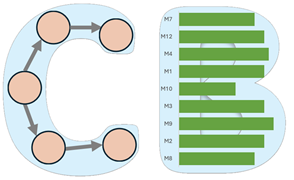

# WSDM Workshop on Benchmarking Causal Models (CausalBench'26)

|  |  | 
|:--:|:--:|
|| |

## Schedule
The workshop will take place during [WSDM'26](https://wsdm-conference.org/2026/), on February 26, 2026, in Boise, Idaho, USA.

## Overview
The WSDM Workshop on Benchmarking Causal Models (CausalBench) aims to promote scientific collaboration, reproducibility, and fairness in causal learning research by providing a dedicated venue for work on benchmarking data, algorithms, models, and metrics for causal learning...

## Topics of Interest
CausalBench welcomes submissions in the following research and application areas:
...

## Submission Guidelines
- Submission Site: ...
- Format: ...

## Important Dates
All deadlines are at 11:59 PM (Anywhere on Earth) unless otherwise noted.
...

## Organizers

### General Chairs
|  |  | 
|:--:|:--:|
|||
|K. Selçuk Candan|Huan Liu|
|Arizona State University|Arizona State University|
|<candan@asu.edu>|<huanliu@asu.edu>|

### Program Chairs
|  |  | 
|:--:|:--:|
|||
|Ruocheng Guo|Paras Sheth|
|Intuit AI Research|Amazon|
|<ruocheng_guo@intuit.com>|<parshet@amazon.com>|

| Web Chair | Publicity Chair  | 
|:--:|:--:|
|||
|Ahmet Kapkiç|Pratanu Mandal|
|Arizona State University|Arizona State University|
|<akapkic@asu.edu>|<pmandal5@asu.edu>|

## Duplicate Submissions and Novelty Requirements
Submissions must present original work not under review elsewhere. Concurrent submission to other venues is not permitted. Papers must cite prior work appropriately, including authors’ own related publications.

## Artifacts and Reproducibility
Authors are encouraged to share code, data, and experimental setups. 

## Inclusion and Diversity
CausalBench embraces the values of diversity and inclusion in writing, participation, and representation. Authors should use inclusive language and examples that avoid stereotyping or marginalization of any group.

## Conflicts of Interest
Authors must declare any conflicts of interest with organizers or reviewers (e.g., recent collaborations, shared affiliations, advisor/advisee relationships). Submissions with incorrect conflict declarations are subject to rejection.

## ACM Publications Policy on Research Involving Human Participants and Subjects
As a published ACM author, you and your co-authors are subject to all ACM Publications Policies, including ACM's new Publications Policy on Research Involving Human Participants and Subjects.

## Policy on Authorship Requirements and GenAI
We follow the ACM policy on authorship requirements. Specifically on the use of generative AI tools and technologies, the guidelines note that: "The use of generative AI tools and technologies to create content is permitted but must be fully disclosed in the Work. For example, the authors could include the following statement in the Acknowledgements section of the Work: ChatGPT was utilized to generate sections of this Work, including text, tables, graphs, code, data, citations, etc.). If you are uncertain about the need to disclose the use of a particular tool, err on the side of caution, and include a disclosure in the acknowledgements section of the Work."

## Contact Information
For questions or clarifications, please contact: wsdm2@causalbench.org

## Acknowledgements
We thank all the contributors and the community for their continuous support and feedback in making CausalBench a reliable and valuable resource for causal learning research.
This workshop is funded by NSF Grant 2311716, "CausalBench: A Cyberinfrastructure for Causal-Learning Benchmarking for Efficacy, Reproducibility, and Scientific Collaboration", and NSF Grants #2230748, "PIRE: Building Decarbonization via AI-empowered District Heat Pump Systems", #2412115, "PIPP Phase II: Analysis and Prediction of Pandemic Expansion (APPEX)" and USACE #GR40695, "Designing nature to enhance resilience of built infrastructure in western US landscapes".