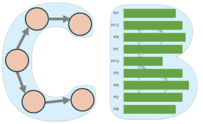

# WSDM Workshop on Benchmarking Causal Models (CausalBench'26)

|  |  | 
|:--:|:--:|
|| |

## Schedule
The workshop will take place during [WSDM'26](https://wsdm-conference.org/2026/), on **February 26, 2026**, in Boise, Idaho, USA.
**Location:** Boise Center, Room 410A.
CausalFlip: A Benchmark for LLM Causal Judgment Beyond Semantic Matching
| 
Time
   | Session |
|---------------|---------|
| 09:00-09:05   | **Introductions** |
| 09:05–10:10   | **Keynote:** Vasilis Syrgkanis - Evaluating Causal Assistants |
| 10:10–10:30   | Jundong Li — *CausalFlip: A Benchmark for LLM Causal Judgment Beyond Semantic Matching* |
| 10:30-11:00   | **Coffee Break** |
| 11:00–11:25   | Ahmet Kapkiç et al. — *CausalBench+: Causal-Informed Machine Learning Benchmarking* |
| 11:25–11:45   | Pradeepthi Mallappa — *Trust but Verify: Benchmarking Causal Verification Layers for Detecting Irrelevant and Hallucinated Responses in Medical RAG* |
| 11:45–12:05   | Hitesh Wadhwa et al. — *From RAGs to Rich Parameters: Probing How Language Models Utilize External Knowledge over Parametric Information for Factual Queries* |
| 12:05–12:25   | Raha Morafah — *Causal Reasoning in the Era of Large Language Models* |
| 12:25-12:45   | Reza Zafarani — *Evaluation in Social Media Research: Challenges and Opportunities* |
| 12:45–13:45   | **Lunch Break** |
| 13:45–14:05   | Junzhe Zhang et al. — *Confounding Robust Deep Reinforcement Learning: A Causal Approach* |
| 14:05–14:25   | Mahmudur Rahman et al. — *ColdNet: Neural Causal Inference Under Extreme Imbalance and Sparsity* |
| 14:25–14:45   | Shuhan Yuan & Lu Zhang — *A Causal Inference Framework for Actionable Fault Diagnosis and Mitigation* |
| 14:45–15:05   | Lu Cheng — *Causal Discovery for Biology: From Molecular to Disease Networks* |
| 15:05–15:30   | **Round Table Discussions** |
| 15:30   | **Coffee Break** |

### Keynote - **Evaluating Causal Assistants**
By Vasilis Syrgkanis - Stanford University

**Speaker Bio**: Vasilis Syrgkanis is an Assistant Professor of Management Science and Engineering and (by courtesy) of Computer Science and Electrical Engineering, in the School of Engineering at Stanford University and a member of the Institute for Computational and Mathematical Engineering. His research interests lie in the areas of machine learning, causal inference, econometrics, online and reinforcement learning, game theory, mechanism design and algorithm design. Until August 2022, he was a Principal Researcher at Microsoft Research, New England, where he was a member of the EconCS and StatsML groups. During his time at Microsoft, he co-led the project on Automated Learning and Intelligence for Causation and Economics (ALICE) and was a co-founder of EconML, an open-source python package for causal machine learning. He received his Ph.D. in Computer Science from Cornell University. His research has received best paper awards at several top tier machine learning and AI conferences (ACM EC, NeurIPS, COLT). He is the recipient of a 2022 Amazon Research Award, a 2023 Google Research Scholar Award, the 2023 Bodossaki Distinguished Young Scientist Award, a 2024 NSF CAREER Award and a 2025 Balakrishnan Early Career Award.

### Accepted Papers
- "Causal Reasoning in the Era of Large Language Models"; Raha Moraffah
- "Causal Discovery for Biology: From Molecular to Disease Networks"; Lu Cheng
- "CausalBench+: Causal-Informed Machine Learning Benchmarking"; Ahmet Kapkic, Pratanu Mandal, Abhinav Gorantla, Shu Wan, Ertugrul Coban, Huan Liu, K. Selcuk Candan
- "From RAGs to rich parameters: Probing how language models utilize external knowledge over parametric information for factual queries"; Hitesh Wadhwa, Rahul Seetharaman, Somyaa Aggarwal, Reshmi Ghosh, Samyadeep Basu, Soundararajan Srinivasan, Wenlong Zhao, Shreyas Chaudhari, Ehsan Aghazedeh
- "ColdNet: Neural Causal Inference Under Extreme Imbalance and Sparsity"; Mahmudur Rahman, Sanskar Tewatia, Dhruv Garg
- "Confounding Robust Deep Reinforcement Learning: A Causal Approach"; Junzhe Zhang, Mingxuan Li, Elias Bareinboim
- "Evaluation in Social Media Research: Challenges and Opportunities"; Reza Zafarani
- "Learning Causality with Graphs"; Jundong Li
- "A Causal Inference Framework for Actionable Fault Diagnosis and Mitigation"; Shuhan Yuan, Lu Zhang
- "Trust but Verify: Benchmarking Causal Verification Layers for Detecting Irrelevant and Hallucinated Responses in Medical RAG"; Pradeepthi Mallappa

## Overview
The WSDM Workshop on Benchmarking Causal Models (CausalBench) aims to promote scientific collaboration, reproducibility, and fairness in causal learning research by providing a dedicated venue for work on benchmarking data, algorithms, models, and metrics for causal learning. CausalBench addresses the growing need for unified, publicly available, and configurable benchmarks that support causal discovery, causal effect estimation, and more general causal inference and learning research problems (e.g., A/B testing, experimental design, mechanistic interpretability, causal reasoning and causal RL etc.) across diverse applications, such as web search, data mining, public health, and sustainability.

Standardized evaluation has historically driven progress in machine learning, as seen with UCI ML and KDD repositories, by encouraging collaborative research and reproducible science. The causal learning community now faces similar challenges: lack of unified benchmark datasets, algorithms, and metrics for reproducible evaluation. CausalBench workshop aims to

- help identify existing datasets and metrics for causal learning and integrate them into standardized evaluation protocols,
encourage coverage, calibration, and uncertainty reporting for causal estimates,
- develop ontologies for benchmarking, improving transparency and collaboration,
- address challenges of incomplete causal knowledge and integration of heterogeneous datasets, and
- help define evaluation standards to scientifically quantify progress in causal learning.

The workshop will bring together researchers and practitioners to discuss new algorithms, datasets, and evaluation methodologies that help establish trust in causal learning innovation. Our goal is to foster discussion and community practices that make evaluation more transparent and comparable across different causal tasks—e.g., clarifying task taxonomies, surfacing assumption-linked metrics, and sharing accessible benchmark resources and artifacts.

By encouraging open exchange on datasets and metrics, the workshop aims to catalyze incremental, evidence-based improvements to causal evaluation.

## Topics of Interest
CausalBench welcomes submissions in the following research and application areas:

- **Benchmarking and Evaluation:** Software frameworks, datasets, standard workflows/pipelines, and metrics for evaluating causal learning algorithms.
- **Algorithmic Advances:** Novel causal discovery and causal inference models/algorithms with reproducible benchmarking results.
- **Data and Systems:** Open-source platforms for data exchange, (automatic) model evaluation, and reproducing results for any causality related research problems: e.g., causal inference, causal discovery, causal representation learning, and causal recommendation.
- **Trustworthy AI:** causality-inspired methods, datasets, or metrics for benchmarking any aspect of trustworthiness of various AI systems and methods, including interpretability, safety, robustness, bias, and fairness.
- **Applications:** Real-world demonstrations of causal benchmarking in domains, such as healthcare, finance, sustainability, and social systems—with a particular emphasis on applications in web search and data mining.

Additional thematic sessions (e.g., invited talks, panels) will be held on emerging challenges in causal benchmarking.

## Submission Guidelines
- **Submission Site:** [​​https://easychair.org/my/conference?conf=causalbench26](https://easychair.org/my/conference?conf=causalbench26)
- **Format:** Submissions must be formatted according to the [ACM SIG Proceedings Template double-column format](https://www.acm.org/publications/proceedings-template), with a font size no smaller than 9pt.
- **Length:** We invite submissions of extended abstracts (2-3 pages, excluding references) and research articles (4-6 pages, excluding references) that align with the workshop's themes.
- **File Type:** PDF, maximum file size 10 MB.
- **Review Process:** Single-blind review.
- **Accepted Papers:** All accepted papers will be presented at the workshop and included in the official WSDM Companion Proceedings Volume.

## Artifacts and Reproducibility
Submissions are encouraged to emphasize reproducibility, benchmark availability, and evaluation methodology. Authors are encouraged to make public and include links to code, datasets, experimental setups, and other supporting materials. While not required, the authors are also encouraged to share the relevant artifacts (data, model, metric, and benchmark runs) on [CausalBench’s repositories](https://causalbench.org). 

## Important Dates
All deadlines are at **11:59 PM (Anywhere on Earth)** unless otherwise noted.

| | |
|-|-|
|**Stage**|**Date**|
|Paper Submission Deadline|{--Nov 13, 2025--} **Extended to Dec 7, 2025!**|
|Author Notification|{--Dec 18, 2025--} **Extended to Jan 5, 2026!**|
|Camera-ready Deadline|Feb 5, 2026|
|Workshop Date|Feb 26, 2026|

## Organizers

### General Chairs
|  |  | 
|:--:|:--:|
|||
|K. Selçuk Candan|Huan Liu|
|Arizona State University|Arizona State University|
|<candan@asu.edu>|<huanliu@asu.edu>|

### Program Chairs
|  |  | 
|:--:|:--:|
|||
|Ruocheng Guo|Paras Sheth|
|Intuit AI Research|Amazon|
|<ruocheng_guo@intuit.com>|<parshet@amazon.com>|

| Web Chair | Publicity Chair  | 
|:--:|:--:|
|||
|Ahmet Kapkiç|Pratanu Mandal|
|Arizona State University|Arizona State University|
|<akapkic@asu.edu>|<pmandal5@asu.edu>|

### PC Members
- Aman Chadha,	Apple Inc/Stanford University
- Chengshuai Zhao,	Arizona State University
- Feng Vic,	Harvard University
- Kaida Zhang,	Amazon
- Lyu Yi,	University of Wisconsin-Madison
- Mustafa Bozdag,	Amazon
- Pulkit Verma,	Indian Institute of Technology, Madras
- Shicheng Fan,	University of Illinois Chicago
- Shu Wan,	Arizona State University
- Tom Heffernan, Worcester Polytechnic Institute
- Weiyi Qin,	Rutgers University
- Yu Mao,	City University of Hong Kong
- Yunfan Hu,	Amazon
- Josh Rountree, Massachusetts Institute of Technology

## Duplicate Submissions and Novelty Requirements
All submissions will undergo a rigorous peer-review process to ensure quality and originality. Submissions must present original work not under review elsewhere. Concurrent submission to other venues is not permitted. Papers must cite prior work appropriately, including authors’ own related publications. The submitted paper must **substantially** differ from earlier workshop papers by the same authors.

## Inclusion and Diversity
CausalBench embraces the values of diversity and inclusion in writing, participation, and representation. Authors should use inclusive language and examples that avoid stereotyping or marginalization of any group.

## Conflicts of Interest
Authors must declare any conflicts of interest with organizers or reviewers (e.g., recent collaborations, shared affiliations, advisor/advisee relationships). Submissions with incorrect conflict declarations are subject to rejection.

## ACM Publications Policy on Research Involving Human Participants and Subjects
As a published ACM author, you and your co-authors are subject to all ACM Publications Policies, including ACM's new Publications Policy on Research Involving Human Participants and Subjects.

## Policy on Authorship Requirements and GenAI
We follow the ACM policy on authorship requirements. Specifically on the use of generative AI tools and technologies, the guidelines note that: *"The use of generative AI tools and technologies to create content is permitted but must be <u>fully disclosed in the Work</u>. For example, the authors could include the following statement in the Acknowledgements section of the Work: ChatGPT was utilized to generate sections of this Work, including text, tables, graphs, code, data, citations, etc.). If you are uncertain about the need to disclose the use of a particular tool, err on the side of caution, and <u>include a disclosure in the acknowledgements section of the Work.</u>"*

## Contact Information
For questions or clarifications, please contact: <wsdm26@causalbench.org>

## Acknowledgements
We thank all the contributors and the community for their continuous support and feedback in making CausalBench a reliable and valuable resource for causal learning research.
This workshop is funded by NSF Grant 2311716, "CausalBench: A Cyberinfrastructure for Causal-Learning Benchmarking for Efficacy, Reproducibility, and Scientific Collaboration", and NSF Grants #2230748, "PIRE: Building Decarbonization via AI-empowered District Heat Pump Systems", #2412115, "PIPP Phase II: Analysis and Prediction of Pandemic Expansion (APPEX)" and USACE #GR40695, "Designing nature to enhance resilience of built infrastructure in western US landscapes".
